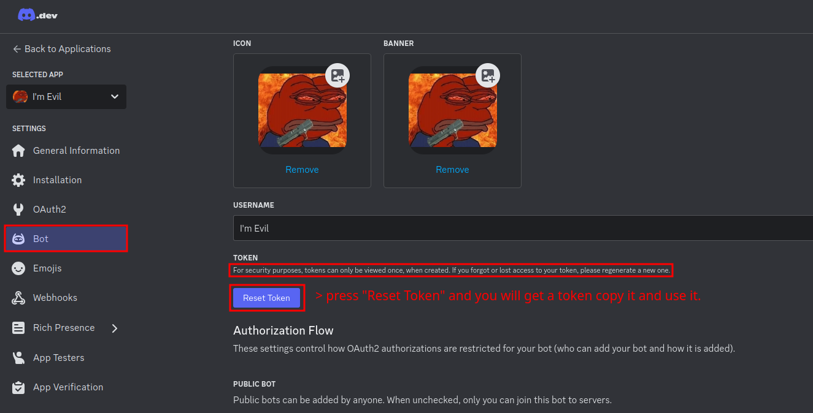

# Evil Bot  

**Evil Bot** is a Discord bot written in Python using `discord.py`. It is an intentionally vulnerable bot created for educational purposes, particularly for cybersecurity training. The bot contains a critical security flaw—an `eval()` function that introduces a Remote Code Execution (RCE) vulnerability. 

This bot was initially created by me for the WeShieldCyber CTF Event qualifiers, but I decided to make it public so that everyone can access it and learn from it.

---

## Features  

| Command             | Description                                       | Notes                              |  
|---------------------|---------------------------------------------------|------------------------------------|  
| `!work`            | Earn random cash.                                 | Gain virtual currency.             |  
| `!lb`              | View the leaderboard.                             | Check top earners.   |  
| `!rob`             | Try robbing a bank.                               | Risky, but can yield rewards!      |  
| `!school`          | Spend cash to gain knowledge books.               | Invest in virtual education.       |  
| `!buy calculator`  | Purchase access to the calculator.                | Required for `!calculator`.        |  
| `!calculator`      | Perform math operations (if purchased).           | Example: `!calculator 5 + 5`.      |  

---

## Directory Structure  

```plaintext  
.  
├── .env                 # Environment variables for the bot (token).  
├── docker-compose.yml   # Docker Compose file for containerized setup.  
├── Dockerfile           # Dockerfile for building the bot container.  
└── src  
   ├── bot.py            # Main bot script.  
   ├── data.json         # Persistent data storage (e.g., user stats).  
   └── requirements.txt  # Python dependencies.   
```

---

## Setup  

### Prerequisites  

- Docker Engine installed on your system.
- A Discord bot token (create one via the [Discord Developer Portal](https://discord.com/developers/applications)).

---

### Deployment Using Docker  

1. **Clone the Repository:**  
   ```bash  
   git clone https://github.com/Rezy-Dev/Evil-Bot.git  
   cd Evil-Bot
   ```

2. **Set Up Environment Variables:**
    - Create a `.env` file (it's already there just replace the bot token) in the root directory with the following content:
    ```env
    DISCORD_TOKEN=REPLACE_DISCORD_BOT_TOKEN_HERE
    ```
    - You will get token from your app you created:
    

3. **Build the Docker Image:**
    ```bash
    docker compose up -d
    ```
    > After this the bot should be **online.**

---

## Invite the Bot to Your Server  

1. Go to the [Discord Bot Permission Calculator](https://discordapi.com/permissions.html).  
2. Set the required permissions for the bot and add your "Client ID" or "Application ID" of your bot which will generate an invite link.  
3. Use the invite link to add the bot to your Discord server.  

---

## Invited?!
Since you invited the bot, read the following article from the author about `eval()` function used in discord bots which causes Remote Code Execution:
- https://rezydev.xyz/research/learn-how-eval-function-is-evil-for-discord-bots/

---

## License
License? What is this, a driver's license? A drinking license? Do we even need one here??? 

Well, technically, yes. There is a [MIT License](https://github.com/Rezy-Dev/Evil-Bot/blob/main/LICENSE) (but don’t worry, it’s not as complicated as it sounds).
